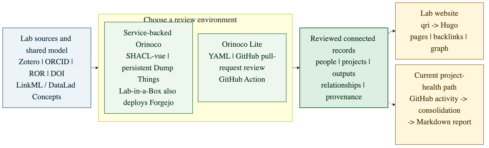

# Beyond the Lab Website: Reusing Structured Research Metadata Across Lab Operations

## Presenters

- John Lee <[leej3@dartmouth.edu](mailto:leej3@dartmouth.edu)>, Department of Psychological and Brain Sciences, Dartmouth College / Center for Open Neuroscience, ORCID [0000-0001-5884-4247](https://orcid.org/0000-0001-5884-4247)
- Isaac To <[Isaac.C.To@dartmouth.edu](mailto:Isaac.C.To@dartmouth.edu)>, Department of Psychological and Brain Sciences, Dartmouth College / Center for Open Neuroscience, ORCID [0000-0002-4740-0824](https://orcid.org/0000-0002-4740-0824)
- Yaroslav O. Halchenko <[yaroslav.o.halchenko@dartmouth.edu](mailto:yaroslav.o.halchenko@dartmouth.edu)>, Department of Psychological and Brain Sciences, Dartmouth College / Center for Open Neuroscience, ORCID [0000-0003-3456-2493](https://orcid.org/0000-0003-3456-2493)

## Keywords

research information management; metadata reuse; knowledge graphs; semantic interoperability; AI-assisted research

```{=latex}
\newpage
```

## Abstract

Research groups repeatedly need the same facts for their basic operations (CVs, grant applications, yearly reporting etc.).
Those facts are scattered across email, spreadsheets, proposals, institutional systems, and web pages, so each task begins by recovering what the lab already knows.
A shared infrastructure to help organize this data improves efficiency and accuracy in lab operations.
A lab website is a good example of something that would greatly benefit from being built on top of such an information system.

Research-information management is an established field [1]-[3].
CERIF, VIVO, and DSpace-CRIS model institutional records, while OpenAIRE and OpenAlex demonstrate connected scholarly metadata at global scale [1], [4], [5].
By reusing shared identifiers such as ORCID, ROR, and DOI and mappings to terms in PROV-O, a lab-scale schema can build on this broader information landscape rather than create another silo, while retaining the flexibility to describe the local roles, relationships, tools, and emerging work needed for day-to-day operations.
Such a schema organizes the records, constrains their structure, and supports validation as data is entered.
This explicit modeling of lab metadata becomes especially valuable with AI: as AI makes it easier to extract and generate candidate content, the harder task is organizing, validating, and reviewing that content so that only trustworthy information enters the lab’s official record.

Orinoco addresses this need at research-group scale through an open, self-hostable set of interoperating components [6].
LinkML schemas provide machine-readable definitions of people, projects, grants, research outputs, and their relationships.
These schemas drive browser-based forms for entering records and a service that validates submissions and stages them for review before they join the lab’s curated knowledge pool.
Query and rendering tools can then follow the relationships among approved records and reshape them for websites, reports, catalogs, discovery, and other lab operations.

{width=100%}

*Orinoco's open components turn source-specific metadata feeds into a reviewed lab pool and reusable projections; the callouts show the Lab-in-a-Box service setting and CON's additional GitHub-based deployment.*

Using Orinoco as a shared information foundation, Lab-in-a-Box presents a vision for creating lab-controlled digital infrastructure [7].
The Psychoinformatics website, a part of this vision, demonstrates how structured knowledge can efficiently represent a research group’s work: linked records organize the site’s pages, related-item lists, backlinks, and graph navigation [6].
The website therefore illustrates the wider value of curating and modeling lab metadata for reuse across lab operations.

Recognizing this utility, CON adopted Orinoco as the information foundation for our lab website and broader research-information needs, retaining its schemas and processing tools while adapting their operation to our GitHub-centered collaboration and review practices.
For now, we call this adaptation Orinoco Lite [8].
Modeled YAML records in Git constitute the official collection.
Changes may be proposed directly by people or prepared automatically from existing lab sources, such as our Zotero publication group and GitHub activity summarized by `con/solidation`; in either case, they are reviewed through pull requests.
A GitHub Action starts the required Orinoco components for each build and uses them to validate the records and regenerate the website.
We will compare the trade-offs between Psychoinformatics’ service-backed deployment and CON’s GitHub-based adaptation, and invite other labs to consider how structured research information could support their own operations.

For RSEs, the central opportunity is to treat lab metadata as shared infrastructure rather than maintain it separately for each application.
A website provides an immediate and visible use for that infrastructure, but its larger value is an enduring body of curated, structured information that can be reused as the lab’s needs and tools evolve.
```{=latex}
\newpage
```

## Acknowledgments

We thank Michael Hanke, Stephan Heunis and other contributors to DataLad Concepts and the Orinoco ecosystem for the underlying schemas, services, and implementation patterns, and the broader Center for Open Neuroscience team for motivating operational use cases.

OpenAI Codex assisted with source review, initial drafting, and copy-editing of the Abstract and the Connection to Mission, Goals, and Interests of the US-RSE Community.
The authors selected the scope and framing, verified technical claims against the cited software, and reviewed and approved the final text.

## References

1. euroCRIS.
[Common European Research Information Format (CERIF)](https://eurocris.org/services/cerif).
2. OCLC Research and euroCRIS.
[*Practices and Patterns in Research Information Management: Findings from a Global Survey*](https://doi.org/10.25333/BGFG-D241).
3. [Barcelona Declaration on Open Research Information](https://barcelona-declaration.org/background_and_context/).
4. VIVO and DSpace-CRIS.
Open-source research information systems.
[VIVO](https://vivoweb.org/); [DSpace-CRIS](https://4science.com/open-source/).
5. Open scholarly knowledge graphs.
[OpenAIRE Graph](https://graph.openaire.eu/); [OpenAlex](https://developers.openalex.org/).
6. Research-information schemas, services, and projections.
[DataLad Concepts](https://concepts.datalad.org/); [Orinoco](https://www.psychoinformatics.de/projects/orinoco/); [Orinoco documentation](https://hub.psychoinformatics.de/orinoco/); [Psychoinformatics group website](https://www.psychoinformatics.de/).
7. Lab-in-a-Box.
[Deployment toolkit](https://hub.psychoinformatics.de/lab-in-a-box/liab-deployments); M. Hanke et al., [*Lab in a box: A build-your-own-open-lab software toolkit*](https://doi.org/10.5281/zenodo.20583436), OHBM 2026 poster.
8. Orinoco Lite.
[Development repository](https://github.com/con/orinoco-lite-dev); [GitHub Action](https://github.com/con/orinoco-lite-action).
9. Center for Open Neuroscience.
[`solidation`: Produce activity reports from GitHub](https://github.com/con/solidation).

## Connection to Mission, Goals, and Interests of the US-RSE Community

Research software engineers often inherit not only research code, but also the information systems through which groups coordinate their activities and communicate their work to collaborators, funders, institutions, and the public.
Designing those systems as maintainable, reusable infrastructure brings together software architecture, data stewardship, interoperability, governance, and long-term sustainability.
Orinoco provides a concrete setting in which to make that frequently invisible RSE contribution legible.

This contribution advances US-RSE’s Community, Advocacy, and Resources goals in distinct ways.
It gives RSEs a concrete basis for exchanging approaches across labs and institutions; advocates for metadata modeling and stewardship as consequential RSE work; and presents open models and validation workflows that practitioners can evaluate.
It also highlights the RSE judgment required to connect local needs with community standards and choose an operating model a group can sustain.

The conference theme makes this work particularly timely.
AI can help extract and reorganize information from sources a lab already maintains, but its output becomes operationally useful only when it conforms to explicit models and passes accountable human review.
Designing these boundaries is an RSE responsibility and an important part of building information infrastructure on which conventional and AI-assisted workflows can both rely.
