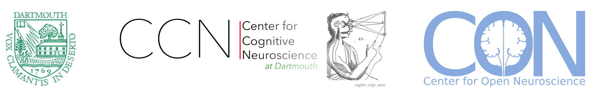
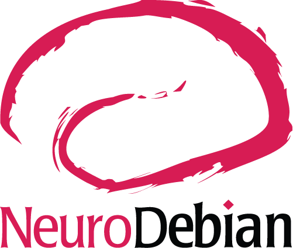
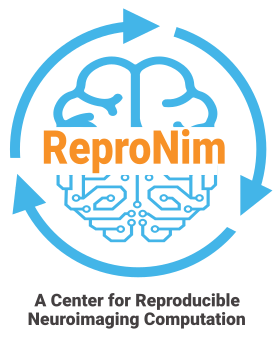
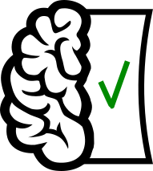
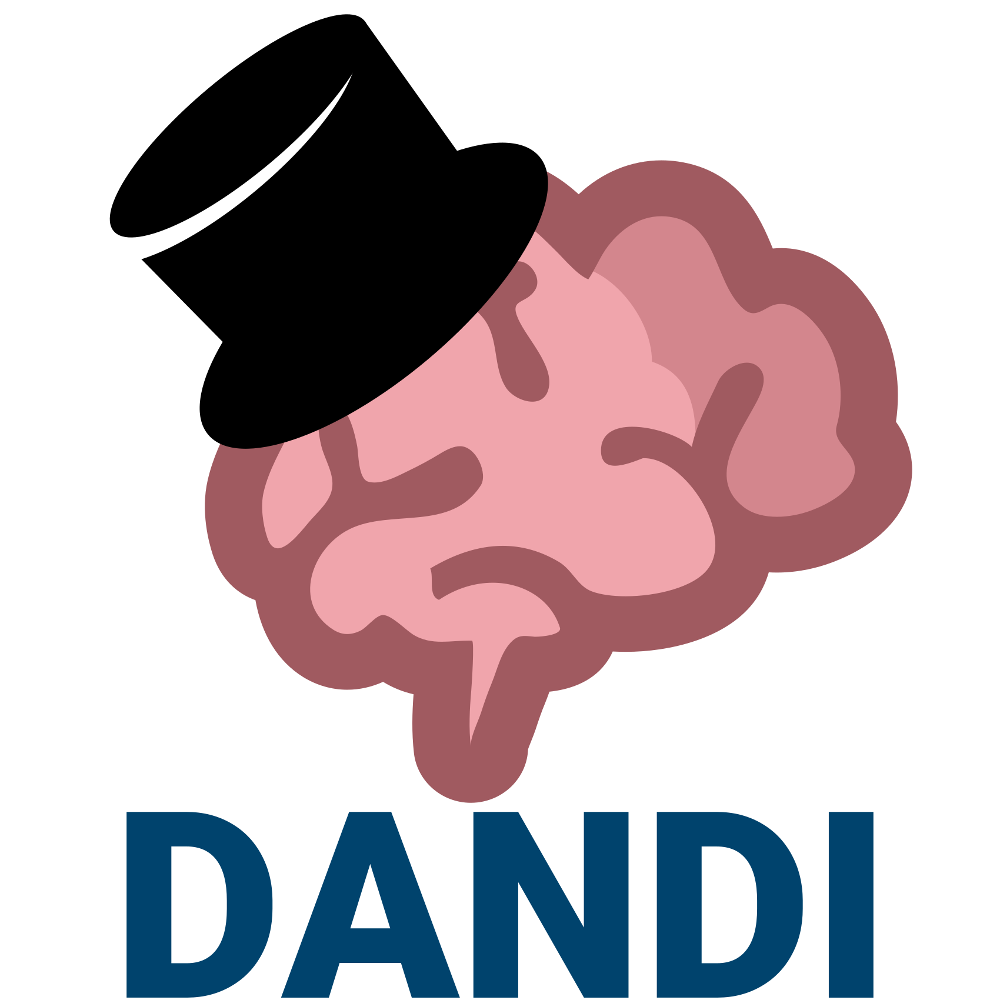
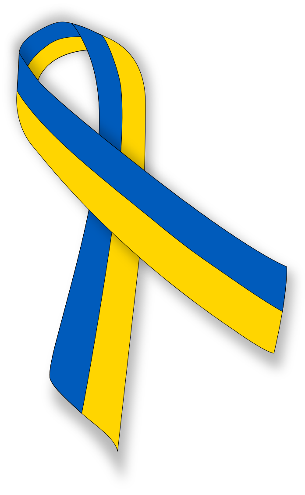

# SOUL — what these talks are *for* and how they look

This file is the long-lived "soul" of the [Center for Open Neuroscience
(CON)](http://centerforopenneuroscience.org/) talks repository. It captures
the recurring **mission**, **voice**, **visual style**, **resources**, and
**citation conventions** that any CON talk should inherit. New talks should
read this first; reusable slide content is indexed in `INDEX.md`.

The technical "how to author / build" guide lives in `CLAUDE.md`.


## 1. Mission

CON talks exist to advocate, by way of working examples, for a single
recurring thesis:

> **Build science as reusable, composable, extensible, standardized
> infrastructure — and, as much as pragmatic, *bridge* upstream
> rather than re-implementing.**

Concretely, almost every talk in the corpus revisits some subset of:

- **Reuse** — "the cheapest reproducible thing is the one you didn't have to
  build". `pkg-exppsy → NeuroDebian`, `PyMVPA ←→ scikit-learn → nilearn`,
  `duecredit → citeproc-py`, `DataLad → git + ←→ git-annex`, `con/duct ←
  brainlife smon`. We *join* upstreams instead of forking.
- **Compose** — small units (HeuDiConv, ReproStim, ReproNim/containers,
  con/duct, DataLad subdatasets, DataLad extensions, BIDS dataset modules, ...)
  over silo'd monoliths.
- **Extend** — when the commons we depend on need care, we stay on as
  (co)maintainers (fail2ban, citeproc-py) as long as needed, or even take over
  the development (heudiconv); we generalize and standardize ad-hoc work
  upstream (DataLad RUNCMD → BEP028 BIDS provenance); we push packages into
  Debian / Debian Med / Debian Science / conda-forge so others reuse them in
  turn but also extend our "workforce".
- **Standardize** — common tech and underlying data models (`git`,
  `git-annex`), common data standards (BIDS, NWB, HED, DICOM), common metadata
  (LinkML, concepts.datalad.org), common organizational layouts (BIDS, YODA,
  STAMPED).  Standards are the language across labs and across HI ↔ AI.
- **Automate** — none of the above scales without it. Unit/integration CI on
  every PR; daily-tested `git-annex` against DataLad; `con/tinuous` archiving
  CI logs and artifacts before they expire; auto-rebuilt `ReproNim/containers`;
  `ReproIn` + `HeuDiConv` driving DICOM→BIDS at the scanner; `ReproStim`
  capturing all stimuli; auto-mirrored dandisets; `con/validation` + `dandi-cli`
  on every release; auto-deployed handbook + per-archive docs.
  In **SciOps** (Johnson *et al.*, 2024) terms this is *Level 4 (Scalable)* —
  what the paper calls "SciOps pipelines". **Cost:** the harness is itself
  code we maintain — and that is exactly where AI assistance becomes the most
  viable way forward as **meta-automation**: using Claude Code + `con/skills`
  + `con/yolo` to maintain the *automations* themselves, taking a small RSE
  center from SciOps L4 toward *L5 (Optimizing)*.
- **Federate, don't recentralize** — `registry.datalad.org`, DANDI/EMBER/
  OpenNeuro, datasets.datalad.org, neurobagel, ... all distribute
  discovery and/or storage rather than becoming a single platform.
  Joining forces where we can contribute (neurobagel, babs) to instill our principles
  and make interchangeable to be "federatable", instead of taking over
- **Make things Convenient** -- buggy, unreliable, hard to use, or requiring
  manual action when could be automated -- is INCONVENIENT.

Recurring framings the speaker leans on:

- "Where data go to die / how data are reincarnated" → archives + reuse
  (`2022-tx-big-neuroscience.html`, `2025-ca-origami-retreat.html`,
  `2023-brain-dandi.html`).
- "Sandwich" / "burger" / "minder" — DataLad as **layered tech** over
  `git-annex` over `git`, with extensions / remote helpers as additional
  layers.
- "All standards are bad, but some are used" (D. Clunie, MICCAI 2017) —
  used to justify pragmatic standardization (`2023-bids-dicom.html`).
- "Make re-use convenient" — every time data integration is mentioned, the
  conclusion arrives back at this.
- **YODA** as a vocabulary of reproducibility (Version control everything;
  Look up you must not; Modular composition).
- **HI + AI** — the recent (2026) framing: the same self-contained, well-
  described, version-controlled artifacts serve both human investigators
  and AI agents.
- **HI ⇄ AI policy spectrum** — different projects need different
  AI-acceptance policies; CON's portfolio spans the full spectrum and we
  show that in talks rather than picking one. Four canonical stances:
  - **Reject** any AI-generated content (e.g. `git-annex` upstream
    contributions in practice — Joey Hess's "policy" page is a famous
    Feb-30 satire; analogues in OSS: Zig, Krita, Clojure, QEMU).
  - **Accept with disclosure** (DataLad / DANDI; `Co-Authored-By: Claude…`
    trailers; `@pytest.mark.ai_generated`; analogues: NumPy, Kubernetes,
    Linux kernel, Django).
  - **Spec-driven AI-generated** (HI specifies, AI writes, HI reviews &
    commits) — AnnexTube, mykrok, con/citations-collector, parts of
    dandi-cli (LAD specs + AI-generated tests).
  - **Autonomous** agents in the loop — con/skills + con/yolo for triage,
    PR review, dependency updates.

  *Common ground (all four):* AI cannot be an author (ICMJE Jan 2026
  update); humans retain full responsibility; AI use must be disclosed
  *inside the artifact* (commit trailer, methods section, acknowledgments).
  STAMPED *Tracking* is what makes that mechanical. SciOps positions
  these as a climb from L3-floor up to L5 (Optimizing).
  External catalog of declared OSS stances:
  [`melissawm/open-source-ai-contribution-policies`](https://github.com/melissawm/open-source-ai-contribution-policies).
- **Static-first vs. service-tied UI** — a recurring contrast: most
  academic data infrastructure is built as a "service-tied UI"
  (LIMS / ELN / bespoke Flask app / Drupal portal) where the View is
  welded to a running backend, so portability and reuse collapse the
  moment the server stops. CON's pattern is the inverse: the Model
  (BIDS / NWB / LinkML / DataLad-tracked file tree) is the artifact;
  Views are derived; services are *one Adapter among many*. Cite
  Cockburn's *Hexagonal Architecture / Ports & Adapters* (2005),
  Evans's *Smart UI* anti-pattern (DDD 2003), Fowler's *Anemic Domain
  Model* + *Service Layer*, and GoF *Adapter / Strategy / Façade* when
  the audience is enterprise-software-literate.
- **Many lenses, one stack** — the same project / artifact can be
  legitimately described along several *overlapping* dimensions, each
  picking out a different property:
  - **Architectural** — Model / View / Controller (mini-section in
    `2026-usrse-con-talk.html`; the standalone spine
    `_backdrawer_/202x-mvc-stack.html` is currently shelved).
  - **Procedural** — STAMPED (Self-containment, Tracking,
    Actionability, Modularity, Portability, Ephemerality,
    Distributability — see Macdonald, Baker, To & Halchenko, 2026,
    [`stamped-principles/stamped-paper`](https://github.com/stamped-principles/stamped-paper)).
  - **Sharing** — FAIR (Findable, Accessible, Interoperable, Reusable).
  - **Compositional** — YODA (modular, "look up you must not",
    version-control everything).
  - **Purpose** — acquisition / curation / archive / analysis /
    governance / sharing / training.
  - **Maturity** — operational maturity per SciOps
    (Johnson *et al.*, 2024; arXiv:2401.00077; five-level Capability
    Maturity Model for rigorous scientific operations — cited from the
    STAMPED paper); agentic-readiness axis via the AI-coding ladder L1–L5
    (`2026-ca-origami-retreat-aicoding.html`).

  Use lenses *together*, not as competitors. When two lenses disagree
  about whether something is "good", that's usually a real design
  tension worth surfacing on the slide, not noise to smooth over.

## 2. Audience and tone

- Audiences range from neuro-domain (NWB/DANDI, BIDS WGs, ReproNim
  webinars) to general RSE / HPC / data-management (US-RSE, distribits, CA
  Origami retreat, NIH compcore). Talks usually pick a domain hook and
  then quickly broaden to the domain-agnostic stack.
- Voice: first-person plural ("we"), occasionally first-person ("Yarik's
  first move was..."), liberal Yoda phrasing on YODA-flavored decks
  ("Track you must!", "Look up you must not"), and dry humor in Reality
  Check / disclaimer slides ("idiocracy-fixed.gif").
- Concrete "Take home" / "Monday checklist" lists at section ends are a
  staple — the audience should leave with one thing they can do this week.
- Respect for collaborators is loud: every deck ends with an Acknowledgements
  slide naming **funders** (NIH, NSF, BMBF, ERDF, BInC), **collaborators**
  (HBP, CONP, VBC, ReproNim, OpenNeuro, CBRAIN, brainlife, DANDI), and
  upstream people (Joey Hess, Michael Hanke, the DataLad team).
- Solidarity tag: a small Ukrainian flag ribbon
  (`pics/Ukrainian_Blue-Yellow_ribbon.svg`) appears in the title slide
  logo strip — keep it.

## 3. Visual style and reveal.js conventions

All decks are [reveal.js](https://revealjs.com/) HTML, **theme `beige`**,
with the highlight plugin's `monokai` syntax theme. The repository's vendored
`reveal.js/`, `reveal.js-mermaid-plugin/`, and `css/custom.css` are the
canonical assets. Do not introduce a new theme without reason.

### Standard header

```html
<!doctype html>
<html>
<head>
  <meta charset="utf-8">
  <meta name="viewport" content="width=device-width, initial-scale=1.0,
                                 maximum-scale=1.0, user-scalable=no">

  <title>Talk Title</title>
  <meta name="description" content="Slides for VENUE / DATE">
  <meta name="author" content=" Yaroslav O. Halchenko ">

  <link rel="stylesheet" href="css/custom.css">
  <link rel="stylesheet" href="reveal.js/dist/reset.css">
  <link rel="stylesheet" href="reveal.js/dist/reveal.css">
  <link rel="stylesheet" href="reveal.js/dist/theme/beige.css">
  <link rel="stylesheet" href="reveal.js/plugin/highlight/monokai.css">
</head>
<body><div class="reveal"><div class="slides">
  <!-- slides go here -->
</div></div>
<script src="reveal.js/dist/reveal.js"></script>
<script src="reveal.js/plugin/notes/notes.js"></script>
<script src="reveal.js/plugin/markdown/markdown.js"></script>
<script src="reveal.js/plugin/highlight/highlight.js"></script>
<script src="reveal.js-mermaid-plugin/plugin/mermaid/mermaid.js"></script>
<script>
  Reveal.initialize({
    hash: true,
    width: 1400, height: 1050,         /* recent default; older talks used 1920x1080 */
    margin: 0.1,
    minScale: 0.2, maxScale: 1.0,
    progress: true, history: true, center: true,
    controls: true, slideNumber: 'c',
    pdfSeparateFragments: false,
    pdfMaxPagesPerSlide: 1,
    pdfPageHeightOffset: -1,
    transition: ['slide', 'fade'],
    plugins: [ RevealMarkdown, RevealHighlight, RevealNotes, RevealMermaid ]
  });
</script></body></html>
```

- **Canvas size**: `1400 x 1050` is the current default
  (`2025-distribits-YODA`, `2026-repronim-YODA-BIDS-webinar`,
  `2026-ca-origami-retreat-aicoding`); older decks used `1920 x 1080`.
  Stick to **1400×1050** for new talks unless the venue insists on 16:9.
- **Plugins**: always include `RevealMarkdown`, `RevealHighlight`,
  `RevealNotes`, `RevealMermaid`. Recent decks add `RevealSearch`
  (Ctrl+Shift+F) — fine to include.
- **`data-src`** for images so reveal.js lazy-loads them.

### Title slide template

```html
<section><section>
  <a href="http://centerforopenneuroscience.org/">
    
  </a>
  <h2 style="margin-top:0.3em;margin-bottom:0.3em;">Title goes here</h2>
  <p style="font-size:0.75em;font-style:italic;">Optional subtitle / yoda one-liner</p>

  <div style="margin-top:0.3em;text-align:center">
    <table style="border:none;">
      <tr><td>
        Yaroslav O. Halchenko<br>
        <small><a href="https://twitter.com/yarikoptic" target="_blank">
          @yarikoptic</a></small>
        <small><a href="https://fosstodon.org/@yarikoptic" target="_blank">
          @yarikoptic@fosstodon.org</a></small>
      </td></tr>
      <tr><td>
        <small><br>
          <a href="http://centerforopenneuroscience.org/">Center for Open Neuroscience</a><br>
          <a href="https://pbs.dartmouth.edu/">Department of Psychological and Brain Sciences</a><br>
          <a href="https://www.dartmouth.edu/ccn/">Center for Cognitive Neuroscience</a><br>
          <a href="http://www.dartmouth.edu">Dartmouth College, New Hampshire, USA</a>
        </small>
        -qrcode.png"/>
      </td></tr>
    </table>
  </div>

  <small>
    <strong>VENUE — DATE</strong><br/>
    Live slides/<a href="https://datasets.datalad.org/centerforopenneuroscience/talks/.git">Sources</a>:
    <a href="https://datasets.datalad.org/centerforopenneuroscience/talks/<TALK-ID>.html">…/<TALK-ID>.html</a>
  </small>
  <small>
    <a href="http://datalad.org"></a>
    <a href="http://neuro.debian.net"></a>
    <a href="http://repronim.org"></a>
    <a href="https://open-brain-consent.readthedocs.io"></a>
    <a href="https://dandiarchive.org"></a>
    <a href="https://bids.neuroimaging.io/"></a>
    <a href="https://standforukraine.com/"></a>
  </small>
</section></section>
```

- **QR code** points to the live-slides URL on
  `datasets.datalad.org/centerforopenneuroscience/talks/<TALK-ID>.html`.
  Generate one per talk and save as
  `pics/<TALK-ID>-qrcode.png`.
- **Logo strip** at the bottom: pick the relevant subset from the canonical
  set — DataLad, NeuroDebian, ReproNim, OBC, DANDI, BIDS, YODA,
  Ukraine ribbon. Keep order roughly stable.
- **Author block**: keep the four-line affiliation (CON / PBS / CCN /
  Dartmouth) verbatim across talks for consistency.
- The first `<section>` is wrapped in another `<section>` (reveal.js
  vertical stack convention) so a vertical sub-deck can sit under the
  title without restructuring.

### Slide-construction patterns to reuse

These conventions show up across multiple talks; reuse them rather than
inventing new ones.

- **Section divider** with a "Challenge:" headline on a soft gradient:
  `<section data-background-gradient="radial-gradient(white, #f7dfd3)">`.
  Used heavily in `2022-nih-compcore.html`, `2023-brain-dandi.html`,
  `2023-lbl-building-dandi.html`.
- **Buddha / Yoda backgrounds** for "nirvana" sections:
  `data-background="pics/digits-budda.svg" data-background-opacity="0.9"`.
- **Markdown sub-decks**: long content uses
  `<section data-markdown data-separator="^\n----\n" data-vertical="^\n---\n">
   <textarea data-template>… markdown …</textarea></section>` —
  this is the dominant style in the 2025/2026 talks.
- **Layered fragment images** (showing a dataset directory tree progressively
  reveal): `r-stack` or absolutely-positioned ``
  layered with descending top/left offsets. See
  `2024-distribits-datalad.html` "2017: DataLad crawler pipeline".
- **Mermaid diagrams** for pipeline / sandwich layering / "the Vault"
  inbound/outbound. The mermaid plugin is loaded in every deck.
- **Aside notes** (`<aside class="notes">`) — used freely; keeps speaker
  notes alongside the slide for the `RevealNotes` `s` shortcut.
- **"Take home" closer** at the end of each section: a markdown bullet
  list, often with a single bolded action verb up front.

### What NOT to redesign

- Do not switch theme. The `beige` theme is the visual identity.
- Do not introduce additional CSS files; extend `css/custom.css` if needed.
- Do not introduce per-talk `node_modules` / build steps. Slides ship as
  static HTML opened straight from disk or via the published
  `datasets.datalad.org` mirror. The repo-level `npm install` /
  `npm start` exists for live-reload only (see `README.md`).

## 4. Resources (where things live)

- **Logos & images**: `pics/` (232 files; see `ls pics/` and grep). All the
  CON-flavored marks plus borrowed third-party assets in `pics/borrowed/`.
- **YODA artwork**: `pics/yoda*.png/svg`,
  `pics/yoda-principles-reordered.png`, `pics/principle-vcs.png`,
  `pics/principle-computeenv.png`, `pics/principle-structure.png`,
  `pics/yoda-do-not-look-up.png`, `pics/yoda-all-the-way-down.png`,
  `pics/yoda-hierarchy-with-containers.png`. Source poster:
  <https://github.com/myyoda/poster/blob/master/ohbm2018.pdf>.
- **DataLad ecosystem**: `pics/DataLad-minder.svg` (the canonical DataLad
  ecosystem diagram), `pics/datasets.datalad.org-*.png` snapshots,
  `pics/datalad-extensions.png`.
- **DANDI**: `pics/dandi-slide-modalities.svg`,
  `pics/dandi-slide-services.svg`, `pics/dandi-slide-standards.svg`,
  `pics/dandi-slide-schema.svg`, `pics/DANDI-ecosystem.svg`,
  `pics/DANDI-shot-and-interactions.svg`, `pics/DANDI-FAIR.svg`,
  `pics/DANDI-users-{submitter,researcher,developer,PI}.svg`.
- **BIDS**: `pics/bids-logo-wide.png`, `pics/BIDS_Logo.png`,
  `pics/BIDS-minder.svg` (and `.png`), `pics/bids-yoda.png`,
  `pics/bids-nipoppy.png`, `pics/bids-princeton.png`.
- **NeuroDebian / PyMVPA**: `pics/neurodebian.png`,
  `pics/neurodebian_logo.svg`, `pics/neurodebian-overview.png`,
  `pics/neurodebian-user.png`, `pics/nd_overview.svg`,
  `pics/neuropy_history.svg`, `pics/pymvpa_icon.png`,
  `pics/pymvpa_logo_fromfusionposter.svg`,
  `pics/pymvpa-features.png`, `pics/pymvpa-classification.png`,
  `pics/pymvpa-searchlight*.png`, `pics/pymvpa-transfusion.png`,
  `pics/pymvpa_on_phone.jpg`.
- **CON / Dartmouth letterhead**: `pics/con-ccn-dartmouth-letterhead.svg`
  (always at the top of the title slide).
- **CI / con/tinuous**: `pics/con-tinuous-github.png`,
  `pics/con-tinuous-term.png`, `pics/con-tinuous-term-dandi-cli.png`.
- **con/duct + traces**: `pics/webshot-con-duct.png`,
  `pics/screenshot-duct-{1..4}.png`, `pics/duct-mriqc-cerebra.png`.
- **ReproNim 5 steps**: `pics/repronim-5steps.png`
  (<http://5steps.repronim.org>).
- **OBC**: `pics/OBC_LogoCheck.svg`, `pics/obc-{main,ultimate,tools}.png`.
- **Yoda goal cartoon (the speaker's "north star")**:
  `pics/yarik-goal.svg`.
- **Funder / collaborator logos**: `pics/borrowed/` —
  `nih.png`, `nsf_2020.png`, `nsf1.jpg`, `bmbf_2020.png`, `binc.png`,
  `erdf.png`, `cbbs_logo.png`, `LSA-Logo.png`, `fzj_logo.svg`,
  `hbp_logo.png`, `conp_logo.png`, `vbc_logo.png`, `repronim_logo.svg`,
  `openneuro_logo.png`, `cbrain_logo.png`, `brainlife_logo.png`,
  `dandi_logo.svg`, `bannerthanks.svg`.
- **Stock comics / cartoons**: `pics/borrowed/phdcomics-notfinal.png`,
  `pics/borrowed/scm-history-2016.svg`, `pics/borrowed/versioncontrol.svg`,
  `pics/borrowed/idiocracy-fixed.gif`, `pics/borrowed/twitter-unsolicited-advice.png`,
  `pics/borrowed/chatgpt_german_sandwich.png`,
  `pics/borrowed/2011-book-avogadro-corp.png`,
  `pics/borrowed/2026-ai-intensifies.png`,
  `pics/borrowed/ai-ladder-skills.png`,
  `pics/borrowed/HH12-webshot-20130331.png`,
  `pics/borrowed/reproin-logo.jpg`,
  `pics/borrowed/crcns-vim-1-takendown.png`,
  `pics/borrowed/con-webshot-20150812-front-down.png`.
- **External deps under `3rd-party/`**: `MICCAI_2017_Clunie_DICOM.pdf`
  (used as a citation source).

## 5. Citation conventions

CON talks cite primary literature inline near the relevant slide, in a
small, gray, three-line block. The author of the slide (Halchenko) is
**bolded**, e.g. `<b>Halchenko, Y. O.</b>`. URL is a direct DOI / PubMed
link. Pattern:

```html
<small>
  <a href="https://doi.org/10.21105/joss.03262">
    Y. Halchenko, K. Meyer, B. Poldrack, …, M. Hanke. <em>DataLad: distributed
    system for joint management of code, data, and their relationship.</em>
    Journal of Open Source Software, 6(63):3262, 2021.
    doi: 10.21105/joss.03262
  </a>
</small>
```

A QR code linking to the paper sometimes accompanies the citation
(e.g. `pics/2021-datalad-joss-qrcode.png` next to the JOSS DataLad
citation in `2024-distribits-datalad.html`).

Canonical citations to keep at hand:

- **DataLad (JOSS 2021)**: <https://doi.org/10.21105/joss.03262>
- **NeuroDebian (FNI 2012)**: <https://doi.org/10.3389/fninf.2012.00022>
- **PyMVPA (Neuroinformatics 2009)**:
  <http://dx.doi.org/10.1007/s12021-008-9041-y>
- **PyMVPA unifying paper (FNI 2009)**:
  <http://dx.doi.org/10.3389/neuro.11.003.2009>
- **BIDS (Sci Data 2016)**:
  <https://www.nature.com/articles/sdata201644>
- **Decentralized RDM (Neuroforum 2021)**:
  <https://doi.org/10.1515/nf-2020-0037>
- **Open Brain Consent (HBM 2021)**:
  <https://doi.org/10.1002/hbm.25351>
- **Phantom QA / Nuisance (F1000 2020)**:
  <https://doi.org/10.12688/f1000research.24544.1>
- **Microscopy-BIDS (FNINS 2022)**:
  <https://doi.org/10.3389/fnins.2022.871228>
- **OpenNeuro (eLife 2021)**:
  <https://elifesciences.org/articles/71774>
- **Glatard et al. on numerical reproducibility (FNINF 2015)**:
  <https://doi.org/10.3389/fninf.2015.00012>
- **Hyperalignment (Neuron 2011)**:
  <http://dx.doi.org/10.1016/j.neuron.2011.08.026>
- **STAMPED principles for reproducible research objects (2026)**:
  Macdonald, Baker, To, Halchenko. Sources:
  <https://github.com/stamped-principles/stamped-paper>;
  site: <https://stamped-principles.org/>. STAMPED =
  Self-containment / Tracking / Actionability / Modularity /
  Portability / Ephemerality / Distributability.
- **SciOps (arXiv 2024)**: Johnson *et al.*, *SciOps: Achieving
  Productivity and Reliability in Data-Intensive Research.*
  <https://arxiv.org/abs/2401.00077> — five-level Capability Maturity
  Model for scientific operations; the canonical citation for the
  "Maturity" lens in the *Many lenses, one stack* framing
  (Halchenko is a co-author).

When citing **other CON talks** (frequently done — talks build on each
other), link the live-slides URL on `datasets.datalad.org/centerforopen
neuroscience/talks/<TALK-ID>.html`, optionally with a `#/<slide>/<sub>`
fragment so the deep link goes to a specific slide.

When citing **YouTube** recordings (distribits 2024 talks, ReproNim
webinars, the AI-coding talk), embed an image-as-link to the
thumbnail, with the YouTube URL in a `<small>` underneath.

## 6. License and sharing

- Repository is **CC-BY-SA** (`LICENSE`). Reuse and remix freely; share
  alike.
- Live mirror:
  <https://datasets.datalad.org/centerforopenneuroscience/talks/>.
- Sources: this repository (`git clone https://datasets.datalad.org/
  centerforopenneuroscience/talks/.git`).
- Slides do not depend on a build step for viewing; opening
  `<TALK-ID>.html` directly in Chromium is the lightest path. PDF export
  via `?print-pdf` URL fragment, or the `decktape` Docker recipe in
  `README.md`.

## 7. The recurring "story arcs"

For composing a new talk, these arcs are the materialized templates the
existing decks reach for. Pick one as the spine, then borrow specific
slides from `INDEX.md`.

1. **Origin → Stack → Today** (`2024-distribits-datalad.html`,
   `2022-nih-compcore.html`):
   *History of one tool* → *what got layered on top* →
   *the ecosystem now*.
2. **Challenges → Solutions → Take home** (`2022-nih-compcore.html`,
   `2023-lbl-building-dandi.html`):
   each section opens with a `Challenge:` slide on the radial-gradient
   background, then the answer, then a small "Overall:" / "Take home" wrap.
3. **YODA principle a day** (`2025-distribits-YODA.html`,
   `2026-repronim-YODA-BIDS-webinar.html`):
   one section per principle (Track / Portable Compute / Modular
   Composition / Look Up You Must Not), each ending with a Yoda quip.
4. **Nirvana / data archives** (`2022-tx-big-neuroscience.html`,
   `2025-ca-origami-retreat.html`, `2023-brain-dandi.html`):
   *Where data go to die → Reincarnation → Make re-use convenient*.
5. **AI-coding ladder** (`2026-ca-origami-retreat-aicoding.html`):
   layered "maturity" slides (Levels 1–5), then a 5-stage development
   loop, then real examples.
6. **Reuse / Compose / Extend / Standardize / Automate**
   (`2026-usrse/talk-proposal-draft.md`, this repo's overarching
   framing): the **five-verb spine** that subsumes all of the above
   and is the recommended skeleton for cross-domain RSE audiences.
   *Automate* was the late-named fifth verb (added 2026-05-10) — it
   covers everything CI/harness-related (con/tinuous, daily-tested
   git-annex, auto-mirrored dandisets, ReproIn/HeuDiConv at the
   scanner, etc.) and carries the *meta-automation* (AI ↔ harness
   maintenance) handoff into the HI+AI section.
   The five verbs map directly onto the **SciOps** Capability Maturity
   Model (Johnson *et al.*, 2024; arXiv:2401.00077):
   - **L1 Initial** — ad-hoc, manual; no verbs in play yet.
   - **L2 Managed** — lab-local *Compose* (YODA layouts; internal pipelines).
   - **L3 Defined** — *Reuse / Compose / Extend / Standardize*; FAIR data
     + FAIR workflows. The SciOps paper itself names BIDS, NWB, DataLad/
     git-annex, DANDI, and brainlife.io as L3 exemplars.
   - **L4 Scalable** — *Automate*: "SciOps pipelines", semi-automated
     continuous workflows. Our CI + con/tinuous + auto-mirrored
     dandisets are exactly this.
   - **L5 Optimizing** — AI in the loop; closing the discovery loop.
     This is where the AI-coding ladder (`2026-ca-origami-retreat-
     aicoding.html`) plugs in, but it presupposes L3 below it.

   Practical implication for talk authoring: when you cite one verb,
   also state which SciOps level it corresponds to — RSE audiences
   recognize CMM language even when they don't know the specific paper.
7. **MVC at the stack scale** (mini-section inside
   `2026-usrse-con-talk.html`; the standalone stub
   `_backdrawer_/202x-mvc-stack.html` is currently shelved):
   the *architectural* re-reading of the four verbs — layered standardized
   **Models** (BIDS / NWB / LinkML / `git`+`git-annex`+DataLad), small
   single-purpose **Controllers** (HeuDiConv / NeuroConv / ReproStim /
   `datalad run` / `con/duct` / BIDS-Apps), interchangeable **Views**
   (datasets.datalad.org / DANDI / OpenNeuro / mykrok / AnnexTube /
   Datasette / VisiData / handbook). Useful as the integrating
   *punchline* near the end of any retrospective, or as the spine of a
   stand-alone talk for an RSE-heavy audience.

## 8. Author identity / fixed metadata

- Speaker default: **Yaroslav O. Halchenko**
  (`yaroslav.o.halchenko@dartmouth.edu`,
  ORCID `0000-0003-3456-2493`,
  `@yarikoptic` on Twitter,
  `@yarikoptic@fosstodon.org` on Mastodon).
- Co-author centroids per the proposal draft (CON team):
  Cody Baker (0000-0002-0829-4790), Austin Macdonald
  (0000-0002-8124-807X), Isaac To (0000-0002-4740-0824), Vadim Melnik
  (ORCID TBD).
- Affiliations block (verbatim): Department of Psychological and Brain
  Sciences, Dartmouth College / Center for Open Neuroscience.
